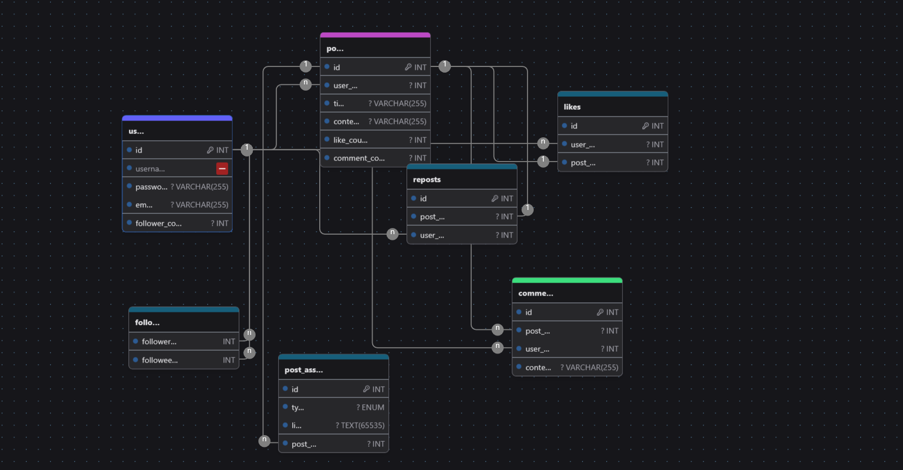

# Connect

Connect to prosta aplikacja webowa typu social media. Ma na celu dzielenie się informacjami przez użyutkowników.

## Rodzaje użytkowników

- **Użytkownik zwykły** - może przeglądać posty innych użytkowników, lajkować je, komentować, tworzyć własne posty.

Connect kieruje się filozofią absolutnej wolności słowa, dlatego nie istnieją tu moderatorzy, a jedynie użytkownicy.

## Wymagania funkcjonalne

- Użytkownik ma własne konto, które może założyć, edytować, usunąć.
- Użytkownik może obserwować innych użytkowników.
- Użytkownik może tworzyć posty, lajkować, komentować i udostępniać posty innych użytkowników.
- Użytkownik może zarządzać swoim kontem oraz postami.

## Baza danych

Mamy tabele:

- `users` - przechowuje dane użytkowników. Klucze kandydackie: `username`, `email`, `id`, ja wybrałem jako klucz główny `id`.
- `posts` - przechowuje posty użytkowników. Tutaj jedyny klucz kandydacki to `id`, który jest kluczem głównym. (teoretycznie użytkownik mógłby mieć dwa posty o tej samej treści) user_id to klucz obcy do tabeli users.
- `comments` - przechowuje komentarze do postów. Klucz kandydacki to `id`, klucz obcy `post_id` do tabeli posts, `user_id` do tabeli users.
- `likes` - przechowuje informacje o polubieniach postów. Klucze kandydackie: id, {user_id, post_id}. Klucz główny to `id`, klucz obcy `post_id` do tabeli posts, `user_id` do tabeli users.
- `followers` - przechowuje informacje o obserwujących użytkowników. Klucze kandydackie: id, {follower_id, followee_id}. Klucz główny to `id`, klucz obcy `follower_id`, `followee_id` do tabeli users.
- `reposts` - przechowuje informacje o udostępnieniach postów. Jedyny klucz kandydacki to `id`, klucz obcy `post_id` do tabeli posts, `user_id` do tabeli users.
- `post_assets` - przechowuje informacje o załącznikach do postów (zdjęcia itp.). Klucze kandydackie: id, {post_id, link}. Klucz główny to `id`, klucz obcy `post_id` do tabeli posts.

Baza została znormalizowana do 3NF, z wyjątkiem: users, posts mają pola *_count. Są one po to, żeby nie musieć liczyć rekordów w czasie rzeczywistym, a liczniki będą potrzebne przy wyświetlanu postów, użytkowników itp.

Planowane triggery: update, insert, delete na tabelach posts, comments, likes, followers, reposts powinny aktualizować *_count w tabelach users, posts.

Funkcje i procedury planuję zaimplementować w aplikacji, a nie w bazie danych. Będą one miały za zadanie wykonywać operacje na bazie danych, np. dodawanie posta, lajkowanie posta, komentowanie posta, obserwowanie użytkownika, itp.

## Prawa dostępu

Każdy użytkownik może oglądać, likować, komentować posty innych użytkowników oraz dodawać swoje posty. Natomiast tylko właściciel może swój post edytować, usunąć itp.